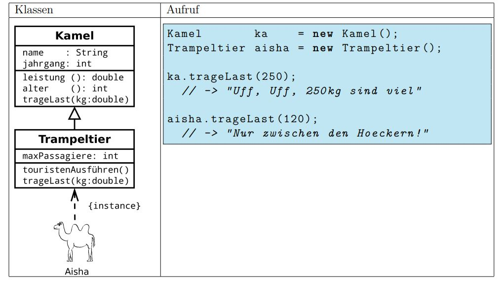

# Ueberladung, Ueberschreiben und Polymorphismus

## Überschreibugn von Methoden

Subklassen können ihre eigenen Methoden haben. Sie können aber auch die Methoden der Superklasse überschreiben. Das bedeutet, dass die Methode der Superklasse durch die Methode der Subklasse ersetzt wird.



Hier überschreibt das Trampeltier die Methode trageLast(double kg) und setzt ein eigenes Verhalten um. Es könnte z.Bsp. darauf beharren, dass die Last nur zwischen Höckern getragen wird.

## Überladung von Methoden

**Überladung** von Methoden ist nicht Vererbung, sondern eine Technik, um mehrere Methoden mit dem gleichen Namen zu haben. Die Methoden unterscheiden sich durch die Anzahl und den Typ der Parameter.

Beispiel von korrektem Überladen:

```java
add(int , int )
add(int, int, int)
```

Beispiel von falschem Überladen:

```java
int add(int, int)
double add(int, int)
```

Es wird auch als **static polymorphism** bezeichnet.

## Polymorphismus

**Polymorphismus** bedeutet, dass ein Objekt in verschiedenen Formen auftreten kann. Es gibt zwei Arten von Polymorphismus:

1. **Compile-time Polymorphism** (auch bekannt als **static polymorphism**): Es wird zur Compile-Zeit entschieden, welche Methode aufgerufen wird. Es wird durch Überladen von Methoden erreicht.

2. **Run-time Polymorphism** (auch bekannt als **dynamic polymorphism**): Es wird zur Laufzeit entschieden, welche Methode aufgerufen wird. Es wird durch Überschreiben von Methoden erreicht.

Beispiel:

```java
Media video = new Video("Falling Down", "John Schlesinger");
```

`Media`ist eine Klasse und `Video` ist eine Subklasse von `Media`. Die Variable `video` ist vom Typ `Media`, aber das Objekt, das es hält, ist vom Typ `Video`. Das Objekt kann also in verschiedenen Formen auftreten.

## Aufruf von überschriebenen Methoden

Wenn nun die Subklassen eine Methode überschreiben, wird dieses Verhalten entsprechend beim Aufruf der Methode ausgeführt.
In diesem Beispiel führt die Database Klasse eine Liste von Medien. Hinter jedem Media Objekt versteckt sich z.Bsp. ein CD-Objekt oder ein DVD-Objekt, etc.

```java
public class Database {

	private ArrayList<Media> media;   //this can be CD, DVD, etc.

	//constructor
	public Database() {
		media = new ArrayList<Media>();
	}

	public void addMedia(Media md) {
		media.add(md);
	}

	/**
	 * This method demonstrates POLYMORPHISM: each subclass reacts differently to
	 * the same print-method
	 */
	public void printList() {

		//one loop for all:
		for (Media md : media) {
			md.print(); //depending on the type of object, the print-out is different => example of POLYMORPHISM
		}
	}
}
```

Falls nun jede Subklasse die print()-Methode überschrieben hat, wird beim Aufruf der Methode das entsprechende spezialisierte Verhalten ausgeführt.
